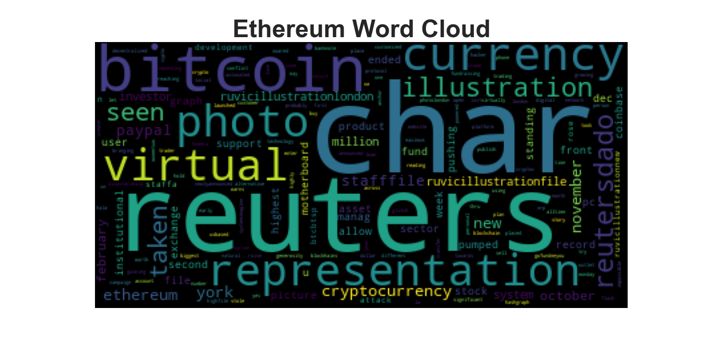

# Unit 12—Tales from the Crypto

## Background

There's been a lot of hype in the news lately about cryptocurrency, so we want to take stock, so to speak, of the latest news headlines regarding Bitcoin and Ethereum to get a better feel for the current public sentiment around each coin.

In this case, natural language processing is used to understand the sentiment in the latest news articles featuring Bitcoin and Ethereum. Fundamental NLP techniques are applied to better understand the other factors involved with the coin prices such as common words and phrases and organizations and entities mentioned in the articles.

The following tasks are completed:

1. [Sentiment Analysis](#Sentiment-Analysis)
2. [Natural Language Processing](#Natural-Language-Processing)
3. [Named Entity Recognition](#Named-Entity-Recognition)

---

### Files

[Starter Notebook](Starter_Code/crypto_sentiment.ipynb)

---

### Instructions

#### Sentiment Analysis

Use the [newsapi](https://newsapi.org/) to pull the latest news articles for Bitcoin and Ethereum and create a DataFrame of sentiment scores for each coin.

Descriptive statistics is used to answer the following questions:

> Which coin had the highest mean positive score?

 * __Answer__: Ethereum has a slightly higher mean positive score.

> Which coin had the highest negative score?

 * __Answer__: Ethereum has the highest compound score.

> Which coin had the highest positive score?

 * __Answer__: Ethereum has the highest positive score with 31.8% maximum positive sentiment in contrast to Bitcoin's 17.4% maximum positive sentiment. 

#### Natural Language Processing

In this section, NLTK and Python are used to tokenize the text for each coin. Tasks to be careful of:

1. Lowercase each word
2. Remove punctuation
3. Remove stop words

Next, we look at the ngrams and word frequency for each coin.

1. Use NLTK to produce the ngrams for N = 2.
2. List the top 10 words for each coin.

Finally, generate word clouds for each coin to summarize the news for each coin.

#### Named Entity Recognition

In this section, you will build a named entity recognition model for both coins and visualize the tags using SpaCy.

---

### Resources

[Vader Sentiment Analysis](http://www.nltk.org/howto/sentiment.html)

---

### Hints and Considerations

The free developer version of the News API limits the total monthly requests, so be careful not to exceed the free limits.

---

### Submission

* Create Jupyter Notebooks for the NLP analysis and host the notebooks on GitHub.

* Include a Markdown that summarizes your homework and include this report in your GitHub repo.

* Submit the link to your GitHub project to Bootcamp Spot.

---

© 2020 Trilogy Education Services, a 2U, Inc. brand. All Rights Reserved.
